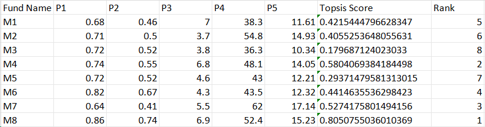

# 🧮 TOPSIS Multi-Criteria Decision Analysis  
### UCS654 – Predictive Analytics & Statistics 

---

## 📌 Project Overview

This repository contains a complete implementation of the **TOPSIS (Technique for Order Preference by Similarity to Ideal Solution)** algorithm developed as part of the UCS654 coursework.

TOPSIS is a multi-criteria decision-making method that ranks alternatives based on their distance from:

- ✅ Ideal Best Solution  
- ❌ Ideal Worst Solution  

The closer an alternative is to the ideal best and farther from the ideal worst, the higher its rank.

---

# 🚀 Implementations Included

This project provides three different implementations of TOPSIS:

| Module | Type | Description |
|--------|------|-------------|
| Program 1 | CLI Tool | Standalone Python script |
| Program 2 | PyPI Package | Installable Python library |
| Program 3 | Web App | Flask-based web interface |

---

# 1️⃣ Command Line Implementation

A simple Python script that runs TOPSIS directly from the terminal.

### ▶ Usage

```bash
python 102317097.py input.csv "1,2,1,1" "+,+,-,+"
```

### 📥 Input Format

| Column | Description |
|--------|-------------|
| Column 1 | Alternative Names |
| Remaining Columns | Numeric Criteria Values |

Example:

| Fund Name | P1 | P2 | P3 | P4 | P5 |
|-----------|----|----|----|----|----|
| M1 | 0.68 | 0.46 | 7 | 38.3 | 11.61 |
| M2 | 0.71 | 0.50 | 3.7 | 54.8 | 14.93 |

---

# 2️⃣ PyPI Package (Version 0.0.3)

The algorithm is also published as an installable Python package.

### 📦 Installation

```bash
pip install Topsis-Savree-102317097==0.0.3
```

### ▶ Usage

```bash
topsis input.csv "1,2,1,1" "+,+,-,+"
```

### 🔗 PyPI Link

https://pypi.org/project/Topsis-Savree-102317097/

---

# 3️⃣ Web Application

A lightweight Flask web interface for running TOPSIS without using the terminal.

### 💻 Run Locally

First install dependencies:

```bash
pip install flask numpy pandas
```

Then run:

```bash
python app1.py
```

Open in browser:

```
http://127.0.0.1:5000
```

---

# 📊 Output

The system generates a ranked CSV file containing:

- **Topsis Score**
- **Rank**

### 📈 Sample Output



---

# 🛠 Technologies Used

- Python
- NumPy
- Pandas
- Flask
- PyPI Packaging

---

# 📂 Repository Structure

```
Program1/              # CLI implementation
Program2/              # PyPI package source
Program3/              # Flask web application
images/                # README assets
README.md
```

---

# ✨ Key Features

✔ Normalization of decision matrix  
✔ Weighted scoring  
✔ Ideal best & worst computation  
✔ Distance calculation  
✔ Final ranking generation  
✔ Available as CLI, Package, and Web App  

---

# 👩‍💻 Author

**Savree Dohar**  
**Roll No:** 102317097  


